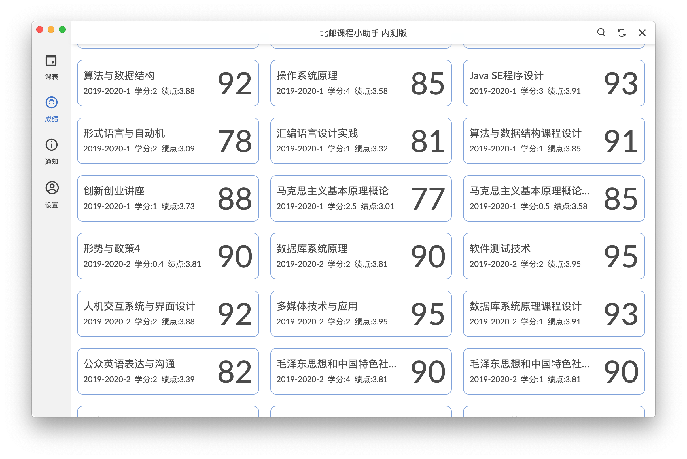

# BUPT Course Assistant - Schedule

北邮课程小助手-课程表项目 Powered by electron

内置WebVPN自动与教务系统同步的看课表、查成绩、看信息门户新闻的电脑端程序。

### 特性

⭐️ 支持北邮WebVPN、自动爬取教务系统

⭐️ 纯本地运行，仅与学校服务器(*.bupt.edu.cn)交换数据，更安全

⭐️ 开源

⭐️ 跨平台，在macOS上支持毛玻璃效果

### 截图

课表：

查询成绩：

浏览信息门户新闻：

设置页面：

### 使用方法

从Release页面中下载对应系统的程序（免安装，目前支持64位Windows、macOS和Apple Silicon macOS）

运行后进入设置输入个人信息保存即可。

### 打包编译

需要node.js环境。下载源代码后进入源代码目录，执行`npm install`安装依赖。使用`npm run package`进行打包。具体打包配置请修改package.json文件。Linux按理来说可用需自行进行打包。

### 隐私声明

该软件不会收集您的任何信息，且仅与*.bupt.edu.cn建立网络连接。用户名及密码会保存在本地方便下次使用。该软件为开源软件，欢迎大家审阅源代码并进行学习、研究及修改。

### TODO

// 输入用户名密码及选择是否使用VPN 分离url.json
// 优化成绩UI 选择列表与平铺展示方法
// 自定义样式

